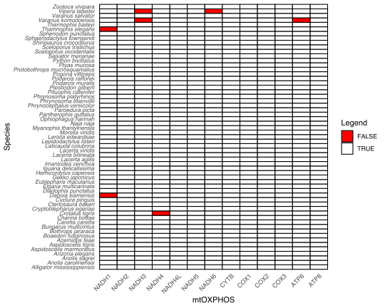

# Completeness Matrix

Need the list of species name (called "species_list.txt). 

ex. 
  
    Python_bivittatus
    Morelia_viridis
    Naja_naja

Then, python (`presence_absence.py`).

Output: `completeness_matrix.csv`, then `sed 's/_/ /'`.

Then, R (`completeness.R`).

---

