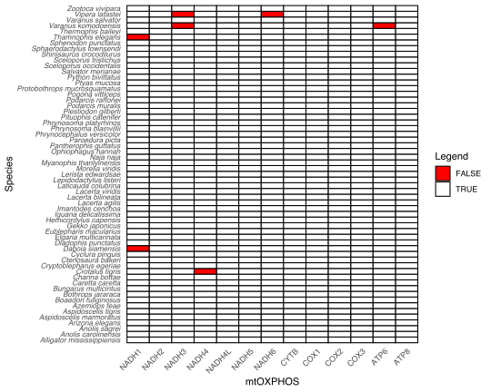
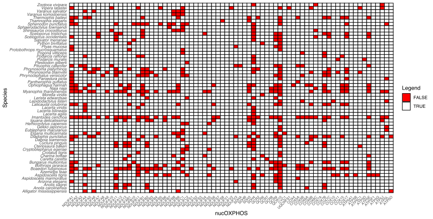

# Completeness Matrix

Need the list of species name (called "species_list.txt). 

ex. 
  
    Python_bivittatus
    Morelia_viridis
    Naja_naja

Then, python (`presence_absence.py`).

Output: `completeness_matrix.csv`, then `sed 's/_/ /'`.

Then, R (`completeness.R`).

>  #Count TRUE and FALSE
  logical_columns <- matrix[, sapply(matrix, is.logical)]
  
  #Conta il numero di TRUE e FALSE
  true_count <- sum(logical_columns, na.rm = TRUE)  # Somma dei TRUE
  false_count <- sum(!logical_columns, na.rm = TRUE) # Somma dei FALSE
  
  #Mostra i risultati
  cat("Numero di TRUE:", true_count, "\n")
  cat("Numero di FALSE:", false_count, "\n")

---

