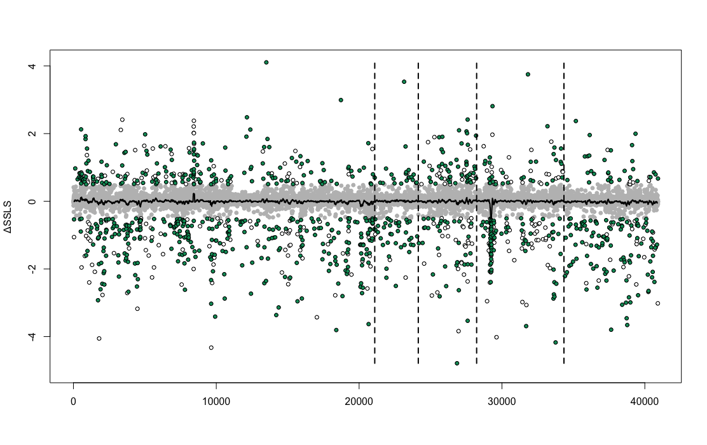

# Single Site Likelihood Support 

Maximum likelihood per site means that the likelihood of each site of our concatenated treefile (concatenated.out) is tested on both mitochondrial and nuclear tree (specie tree) topology.

Command: `raxmlHPC -f G -s concatenated.out -m [model] -z [mt or busco_topology.tree] -n [MT or NUC_hypothesis]`

Then, from the two outputs delta values are extracted (MLxSite-contact - MLxSite-non_contact):
+ values > 0 likelihood towards the MT topology
+ values < 0 likelihood towards the NUC topology

R was used to plot likelihoods. Delta > 0.5 or < -0.5 were highlighted, since they show strong support levels for one tree or the other.

R:
       
+ `mt_mlxsite <- read.table("RAxML_perSiteLLs.MT", skip = 1)`
+ `nuc_mlxsite <- read.table("RAxML_perSiteLLs.NUC", skip = 1)`
+ `mt_mlxsite <- mt_mlxsite[,-1]`
+ `nuc_mlxsite <-nuc_mlxsite[,-1]`
+ `delta <- mt_mlxsite - nuc_mlxsite`
+ `values <- unlist(delta)`

Then:

                           coordinate_genes <- data.frame(
                Gene = c(
                  "ATP5A1", "ATP5B", "ATP5C1", "ATP5D", "ATP5E", 
                  "ATP5F1", "ATP5G", "ATP5J", "ATP5L", "ATP5O", 
                  "COX10", "COX11", "COX15", "COX17", "COX4", 
                  "COX5A", "COX5B", "COX6A", "COX6B", "COX6C", 
                  "COX7A", "COX7B", "COX7C", "CYC1", "NDUFA10", 
                  "NDUFA11", "NDUFA12", "NDUFA13", "NDUFA1", "NDUFA2", 
                  "NDUFA3", "NDUFA4", "NDUFA5", "NDUFA6", "NDUFA7", 
                  "NDUFA8", "NDUFA9", "NDUFAB1", "NDUFB10", "NDUFB11", 
                  "NDUFB1", "NDUFB2", "NDUFB3", "NDUFB4", "NDUFB5", 
                  "NDUFB6", "NDUFB7", "NDUFB8", "NDUFB9", "NDUFC1", 
                  "NDUFC2", "NDUFS1", "NDUFS2", "NDUFS3", "NDUFS4", 
                  "NDUFS5", "NDUFS6", "NDUFS7", "NDUFS8", "NDUFV1", 
                  "NDUFV2", "NDUFV3", "QCR10", "QCR2", "QCR6", 
                  "QCR7", "QCR8", "QCR9", "SDH3", "SDH4", 
                  "SDHA", "SDHB", "UQCRFS1"
                ),
                Intervallo = c(
                  "1-1659", "1660-3249", "3250-4155", "4156-4668", "4669-4902", 
                  "4903-5670", "5671-6123", "6124-6444", "6445-6765", "6766-7458", 
                  "7459-8742", "8743-9501", "9502-10725", "10726-10959", "10960-11523", 
                  "11524-11973", "11974-12378", "12379-12711", "12712-13011", "13012-13248", 
                  "13249-13596", "13597-13854", "13855-14043", "14044-15015", "15016-16092", 
                  "16093-16500", "16501-16938", "16939-17409", "17410-17622", "17623-17925", 
                  "17926-18285", "18286-18600", "18601-18948", "18949-19350", "19351-19695", 
                  "19696-20214", "20215-21390", "21391-21924", "21925-22458", "22459-22911", 
                  "22912-23142", "23143-23457", "23458-23799", "23800-24210", "24211-24786", 
                  "24787-25233", "25234-25623", "25624-26196", "26197-26799", "26800-27120", 
                  "27121-27501", "27502-29724", "29725-31149", "31150-31974", "31975-32532", 
                  "32533-32850", "32851-33252", "33253-33957", "33958-34605", "34606-36006", 
                  "36007-36741", "36742-37941", "37942-38163", "38164-39561", "39562-39843", 
                  "39844-40176", "40177-40422", "40423-40611", "40612-41118", "41119-41685", 
                  "41686-43704", "43705-44586", "44587-45408"
                )
              )

              
                     vettori_genes <- list()
              
              for (i in 1:nrow(coordinate_genes)) {
                  gene <- coordinate_genes$Gene[i]  # Nome del gene
                  intervallo <- unlist(strsplit(coordinate_genes$Intervallo[i], "-"))  # Coordinate
                  
                  if (length(intervallo) == 2) {
                      start <- as.numeric(intervallo[1])
                      end <- as.numeric(intervallo[2])
                      
                      if (!is.na(start) && !is.na(end)) {
                          vettore_gene <- values[start:end]
                          vettori_genes[[gene]] <- vettore_gene
                      } else {
                          warning(paste("Intervallo non valido per il gene:", gene))
                      }
                  } else {
                      warning(paste("Intervallo non riconosciuto per il gene:", gene))
                  }
              }

Then: 

              C_I <- c(vettori_genes$NDUFA1, vettori_genes$NDUFA2, vettori_genes$NDUFA3, vettori_genes$NDUFA4, vettori_genes$NDUFA5, vettori_genes$NDUFA6, vettori_genes$NDUFA7, vettori_genes$NDUFA8, vettori_genes$NDUFA9, vettori_genes$NDUFA10, vettori_genes$NDUFA11, vettori_genes$NDUFA12, vettori_genes$NDUFA13, vettori_genes$NDUFAB1, vettori_genes$NDUFB1, vettori_genes$NDUFB2, vettori_genes$NDUFB3, vettori_genes$NDUFB4, vettori_genes$NDUFB5, vettori_genes$NDUFB6, vettori_genes$NDUFB7, vettori_genes$NDUFB8, vettori_genes$NDUFB9, vettori_genes$NDUFB10, vettori_genes$NDUFB11, vettori_genes$NDUFC1, vettori_genes$NDUFC2, vettori_genes$NDUFS1, vettori_genes$NDUFS2, vettori_genes$NDUFS3, vettori_genes$NDUFS4, vettori_genes$NDUFS5, vettori_genes$NDUFS6, vettori_genes$NDUFS7, vettori_genes$NDUFS8, vettori_genes$NDUFV1, vettori_genes$NDUFV2, vettori_genes$NDUFV3)
              
              C_II<- c(vettori_genes$SDHA, vettori_genes$SDHB, vettori_genes$SDH3, vettori_genes$SDH4)
              
              C_III <- c(vettori_genes$QCR2, vettori_genes$QCR6, vettori_genes$QCR7, vettori_genes$QCR8, vettori_genes$QCR9, vettori_genes$QCR10, vettori_genes$UQCRFS1, vettori_genes$CYC1)
              
              C_IV <- c(vettori_genes$COX4, vettori_genes$COX5A, vettori_genes$COX5B, vettori_genes$COX6A, vettori_genes$COX6B, vettori_genes$COX6C, vettori_genes$COX7A, vettori_genes$COX7B, vettori_genes$COX7C, vettori_genes$COX10, vettori_genes$COX11, vettori_genes$COX15, vettori_genes$COX17)
              
              C_V <- c(vettori_genes$ATP5A1, vettori_genes$ATP5B, vettori_genes$ATP5C1, vettori_genes$ATP5D, vettori_genes$ATP5E, vettori_genes$ATP5F1, vettori_genes$ATP5G, vettori_genes$ATP5J, vettori_genes$ATP5L, vettori_genes$ATP5O)

Plot:

       plot(C_I, pch = 19, cex=0.5, col = ifelse( C_I < -0.5 | C_I > 0.5, "red","black"), main = "Complex I")
       plot(C_II, pch = 19, cex=0.5, col = ifelse( C_II < -0.5 | C_II > 0.5, "red","black"), main = "Complex II")
       plot(C_III, pch = 19, cex=0.5, col = ifelse( C_III < -0.5 | C_III > 0.5, "red","black"), main = "Complex III")
       plot(C_IV, pch = 19, cex=0.5, col = ifelse( C_IV < -0.5 | C_IV > 0.5, "red","black"), main = "Complex IV")
       plot(C_V, pch = 19, cex=0.5, col = ifelse( C_V < -0.5 | C_V > 0.5, "red","black"), main = "Complex V")

    
---

