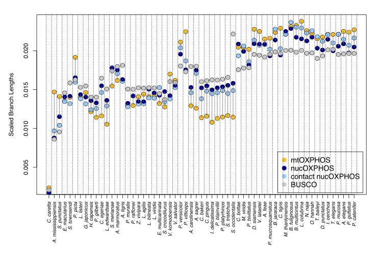

# Scaled branch lengths comparisons

Branch lengths are optimized respect to a custom created phylo tree, based on bibliography (in our case Burbrick et al. 2020). We used RAxML with _"-f e"_ option, specifing the partition file and the model selection.
        
        raxmlHPC -f e -t ortho_erc_test.tree -m GTRGAMMAIX -q mt_nt_oxphos.best_scheme -s concatenated.out -n TEST
        # -t = species tree based on literature.
        # -m = model selected using Modeltest
        # -q = best partitioning scheme obtained from iqtree, or the partition file (in RAxML format)
        # -s = concatenated alignment
        # -n = output prefix

* Branch lengths extractions and normalization.
This step was performed on R. _{adephylo}_, _{ape4}_ and _{ape}_ are necessary packages.
1. read the Newick file resulting from the previous point thorugh _{ape}_: `read.tree(file="FILENAME")`.
2. extract the root-to-tip distances using _distRoot_ (library _{adephylo}_): `distRoot(mito_erc,tips="all",method="patristic")`
3. scale them: `mito_sum<-sum(mito_distances)`; `mito_distnorm<-mito_distances / mito_sum`

---

