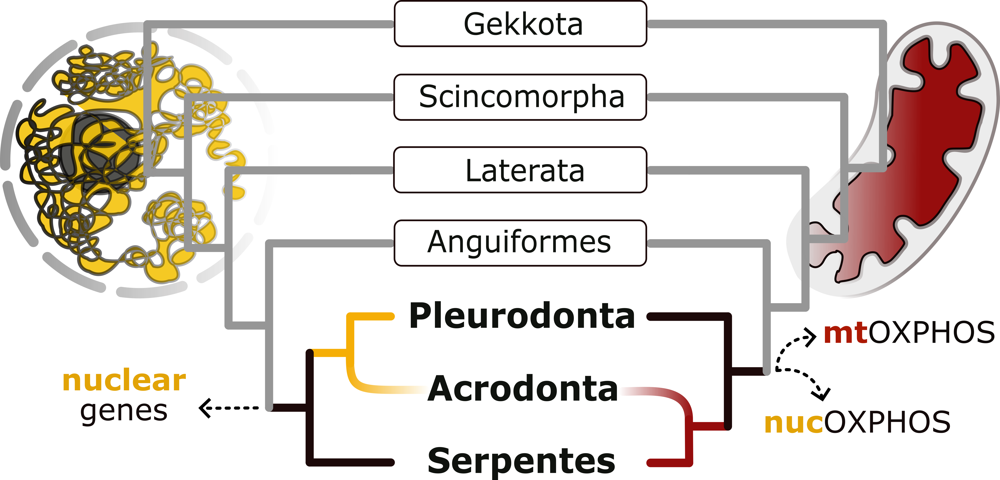

# Squamata

Repo for scripts, pipelines and descriptions. 

|||
|---|---|
|**doi**| https://doi.org/10.1101/2024.11.14.623538 |
| **Title** | Evidence of convergent evolution in the nuclear and mitochondrial OXPHOS genes subunits across the deep lineages of Squamata |

